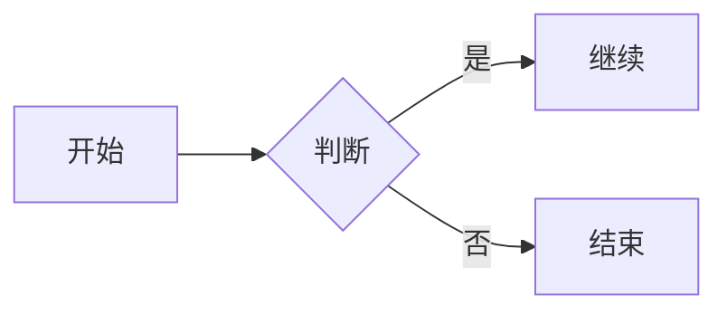

# Markdown 常用语法速查（偏 GitHub Flavored Markdown / GFM）

> 说明：不同平台对 Markdown 的支持不完全一致（如 GitHub、Typora、VS Code、语雀等）。本文以 **GFM**（GitHub 常用风格）为主，尽量标注“可能不支持”的特性。

## 1. 标题

```md
# 一级标题
## 二级标题
### 三级标题
#### 四级标题
```

## 2. 段落与换行

- 段落：用**空行**分隔。
- 强制换行（常见两种）：
  - 行尾加两个空格再回车
  - 使用 HTML：`<br>`

```md
第一行␠␠
第二行  

第一行<br>
第二行
```

## 3. 强调（粗体/斜体/删除线）

```md
*斜体* 或 _斜体_
**粗体** 或 __粗体__
***粗斜体***
~~删除线~~
```

## 4. 引用（Quote）

```md
> 这是引用
>
> > 这是嵌套引用
```

## 5. 列表

### 5.1 无序列表

```md
- A
- B
  - B.1（缩进 2 个空格或 1 个 Tab）
  - B.2
```

### 5.2 有序列表

```md
1. 第一项
2. 第二项
   1. 子项
```

### 5.3 任务列表（GFM）

```md
- [ ] 未完成
- [x] 已完成
```

## 6. 代码

### 6.1 行内代码

```md
用 `printf()` 输出一行
```

### 6.2 代码块（围栏代码块）

````md
```bash
echo "hello"
```
````

- 语言标注会触发语法高亮（如 `bash`、`cpp`、`python`、`json`、`yaml`、`markdown`）。

### 6.3 在代码块里再写 ``` 的办法

把外层围栏改成更多反引号即可：

`````md
````md
```text
这里面可以出现三个反引号
```
````
`````

## 7. 链接

### 7.1 行内链接

```md
[OpenAI](https://openai.com)
```

### 7.2 自动链接

```md
<https://openai.com>
<hello@example.com>
```

### 7.3 参考式链接（适合长文）

```md
这是 [链接文本][id]

[id]: https://example.com "可选标题"
```

## 8. 图片

```md

```

图片也可以做成链接：

```md
[](https://example.com)
```

## 9. 表格（GFM）

```md
| 左对齐 | 居中 | 右对齐 |
| :----- | :--: | -----: |
| A      | B    | C      |
```

## 10. 分隔线

```md
---
***
___
```

## 11. 脚注（部分平台支持，GitHub 支持）

```md
这是一个脚注示例[^1]

[^1]: 这里是脚注内容
```

## 12. 转义与特殊字符

Markdown 会把某些符号当作语法（如 `*`、`_`、`#`、`|`）。想原样显示可用反斜杠：

```md
\* 不会变成斜体
\| 不会被表格识别
```

## 13. 可折叠内容（HTML，GitHub 支持）

```md
<details>
  <summary>点我展开</summary>

这里是展开后的内容
</details>
```

## 14. 数学公式（不一定支持）

有些编辑器/平台支持 LaTeX 风格（GitHub 对部分场景支持有限，且可能随时间变化）：

```md
行内：$E = mc^2$

块级：
$$
\int_0^1 x^2 \, dx
$$
```

## 15. Mermaid 流程图（GFM 常见）

```md

```

## 16. 小技巧（写文更顺手）

- 想写“提示框”效果：用引用 + 加粗前缀（各平台渲染不同）
  ```md
  > **提示：** 这里是一条提示
```
- 想给键盘按键加样式（GitHub 支持）：`<kbd>Ctrl</kbd>+<kbd>C</kbd>`
- 相对路径更利于仓库内迁移：链接/图片尽量用 `./`、`../`。

---

如果你希望我把这个文档做成你的项目主页（覆盖或合并到 `ros2Learn/mycode/readme.md`），告诉我你想要的目录结构（例如：在 `readme.md` 里放一段“语法速查”并链接到本文件）。
